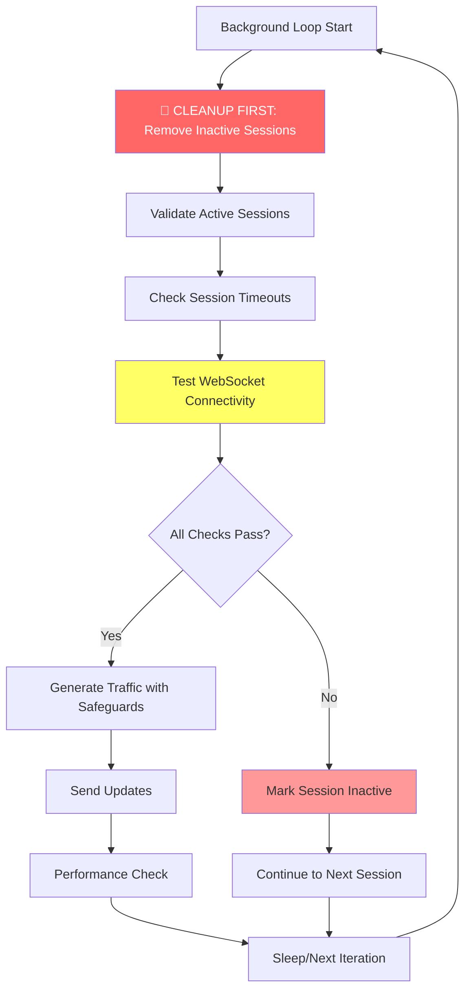
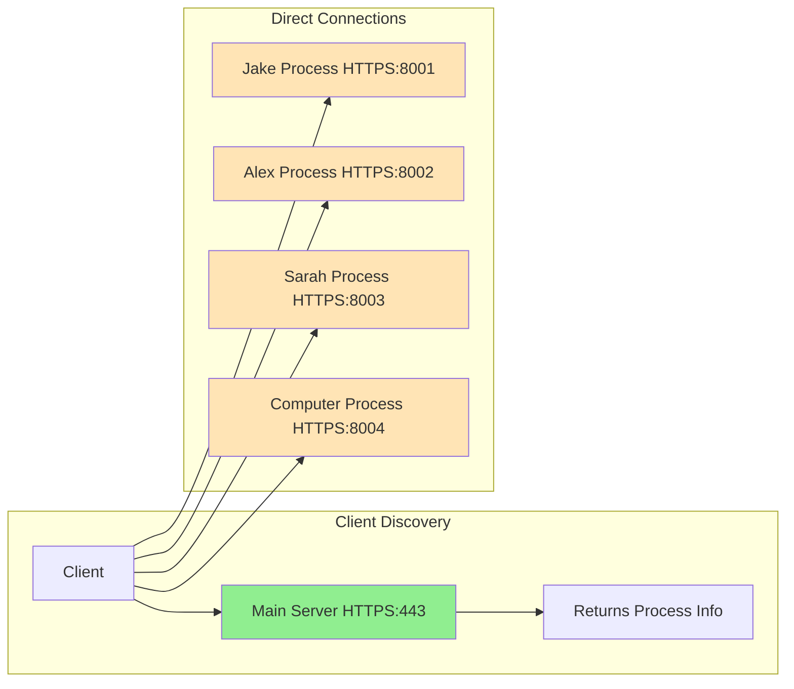
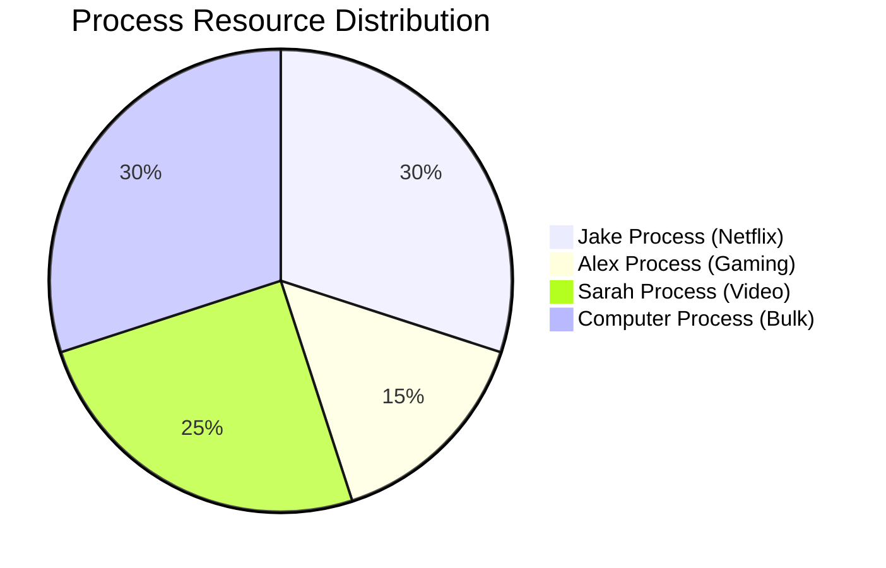
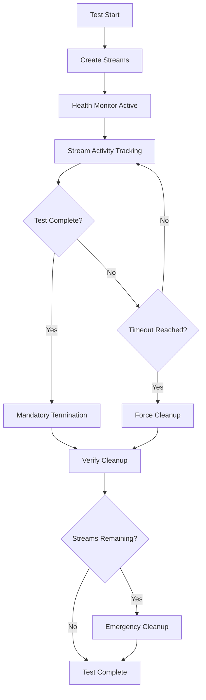

# LibreQoS Bufferbloat Test - System Design

## Overview

The LibreQoS Bufferbloat Test is a comprehensive web-based tool for measuring bufferbloat and network performance under realistic load conditions. The system provides both traditional single-user testing and advanced virtual household simulation to evaluate network behavior under real-world usage scenarios.

## Core Architecture

### Simple Multiprocess Architecture

The system uses a **Simple Multiprocess Architecture** designed for high concurrency and process isolation:

```mermaid
graph TB
    subgraph "Client Side"
        C1[Single User Test Client]
        C2[Virtual Household Client - Jake]
        C3[Virtual Household Client - Alex]
        C4[Virtual Household Client - Sarah]
        C5[Virtual Household Client - Computer]
    end
    
    subgraph "Main Server Process :8000"
        MS[Main Server]
        SU[Single User Endpoints<br/>/download, /upload, /ping]
        VR[Virtual Household Router<br/>/ws/virtual-household/{user_id}]
        FB[Fallback Handler<br/>Single-Process Mode]
    end
    
    subgraph "User-Specific Processes"
        JP[Jake Process :8001<br/>Netflix Profile Only]
        AP[Alex Process :8002<br/>Gaming Profile Only]
        SP[Sarah Process :8003<br/>Video Call Profile Only]
        CP[Computer Process :8004<br/>Bulk Transfer Profile Only]
    end
    
    subgraph "Process Manager"
        PM[Simple Process Manager]
        HM[Health Monitor]
        AR[Auto Restart]
    end
    
    C1 --> MS
    MS --> SU
    
    C2 --> MS
    C3 --> MS
    C4 --> MS
    C5 --> MS
    
    MS --> VR
    VR -->|Route Jake| JP
    VR -->|Route Alex| AP
    VR -->|Route Sarah| SP
    VR -->|Route Computer| CP
    
    VR -->|Fallback if processes down| FB
    
    PM --> JP
    PM --> AP
    PM --> SP
    PM --> CP
    
    HM --> PM
    AR --> PM
```

### Key Architectural Benefits

- **Process Isolation**: Each user type runs in a dedicated process for stability
- **High Concurrency**: Support for 30+ simultaneous tests
- **Direct Connections**: Optimized WebSocket connections (4-18ms latency)
- **Automatic Recovery**: Health monitoring and process restart capabilities
- **Scalable Design**: Easy addition of new user types

## Testing Modes

### Single User Test Mode

Traditional bufferbloat testing with sequential load phases:

1. **Baseline Phase (0-5s)**: Measures unloaded latency baseline
2. **Download Warmup (5-10s)**: Gradual ramp-up to target download speed
3. **Download Saturation (10-20s)**: Full download load with latency monitoring
4. **Upload Warmup (20-25s)**: Gradual ramp-up to target upload speed
5. **Upload Saturation (25-35s)**: Full upload load with latency monitoring
6. **Bidirectional Phase (35-40s)**: Simultaneous download and upload load

### Virtual Household Mode

Advanced simulation recreating realistic household environment with multiple concurrent users:

#### Virtual User Profiles

| User | Activity | Download | Upload | Pattern | Description |
|------|----------|----------|--------|---------|-------------|
| **Alex** | Gaming | 1.5 Mbps | 0.75 Mbps | Constant | Counter-Strike 2 gameplay simulation |
| **Sarah** | Video Conference | 2.5 Mbps | 2.5 Mbps | Bidirectional | Microsoft Teams HD video call |
| **Jake** | Streaming | 25 Mbps | 0.1 Mbps | Burst (1s on, 4s off) | Netflix HD with adaptive bitrate |
| **Computer** | System Updates | 50 Mbps | 2 Mbps | Continuous | Background bulk data transfers |

#### Traffic Pattern Implementation

```mermaid
timeline
    title Virtual Household Traffic Patterns (Process Isolated)
    
    section Jake Process :8001
        Netflix Streaming : 25 Mbps burst (1s)
                         : 0 Mbps pause (4s)
                         : 25 Mbps burst (1s)
                         : 0 Mbps pause (4s)
    
    section Alex Process :8002
        Gaming Traffic   : 1.5 Mbps steady
                        : Low latency priority
                        : Consistent throughput
    
    section Sarah Process :8003
        Video Calls     : 2.5 Mbps bidirectional
                       : Steady upload/download
                       : Real-time requirements
    
    section Computer Process :8004
        Bulk Downloads  : 50 Mbps steady
                       : High throughput
                       : Background priority
```

## Resource Management System

### Session Health Tracking

The system implements comprehensive session management to prevent resource leaks:



### Session Lifecycle Management

- **Inactivity Timeout**: 30 seconds
- **Maximum Session Duration**: 5 minutes
- **Connection Health Testing**: Active ping-based validation
- **Automatic Cleanup**: Immediate termination on connection failures

### Resource Protection Features

- **Pre-generation Session Validation**: Check session health before traffic generation
- **Connection State Monitoring**: Verify WebSocket state before each operation
- **Immediate Termination**: Stop traffic generation on any connection failure
- **Performance Monitoring**: Track loop timing and session health metrics

## Production Deployment

### HTTPS Native Solution

The system supports native HTTPS without reverse proxy overhead:



### SSL Certificate Management

- **Let's Encrypt Integration**: Automatic certificate acquisition and renewal
- **Shared Certificates**: All processes use the same SSL certificate
- **Modern TLS**: TLS 1.3 with strong cipher suites
- **HSTS Headers**: Enhanced security for production deployments

### Systemd Integration

```bash
# Service installation
sudo ./install_service.sh

# HTTPS setup with Let's Encrypt
sudo ./setup_ssl_certificates.sh yourdomain.example.com

# Quick testing with self-signed certificates
sudo ./create_test_certificates.sh
sudo ./start_https.sh
```

## API Design

### Core Testing Endpoints

| Endpoint | Method | Purpose | Server |
|----------|--------|---------|---------|
| `/ping` | GET | Latency measurement | Dedicated ping server :8005 |
| `/download` | GET | Download saturation | Main server :8000 |
| `/upload` | POST | Upload saturation | Main server :8000 |
| `/ws/bulk-download` | WebSocket | High-performance downloads | Main server :8000 |

### Virtual Household Endpoints

| Endpoint | Method | Purpose | Response |
|----------|--------|---------|----------|
| `/ws/virtual-household/{user_id}` | GET | WebSocket redirect | Process port info |
| `/ws/virtual-household/{user_id}` | WebSocket | Direct connection | Process-specific WebSocket |
| `/virtual-household/stats` | GET | System statistics | Process health and metrics |
| `/virtual-household/health` | GET | Health monitoring | Overall system status |
| `/virtual-household/profiles` | GET | User profiles | Available user configurations |

### Process Routing Logic

```python
# Main server routing
@app.get("/ws/virtual-household/{user_id}")
async def websocket_virtual_user_redirect(user_id: str, request: Request):
    if process_manager.is_running():
        port = process_manager.get_port_for_user(user_id)
        if port:
            host = request.headers.get("host", "localhost:8000").split(":")[0]
            ws_protocol = "wss" if process_manager.ssl_enabled else "ws"
            redirect_url = f"{ws_protocol}://{host}:{port}/ws/virtual-household/{user_id}"
            
            return JSONResponse({
                "redirect": True,
                "websocket_url": redirect_url,
                "port": port,
                "user_id": user_id,
                "architecture": "simple_multiprocess",
                "process_isolation": True
            })
```

## Performance Characteristics

### Throughput Capabilities

- **Aggregate Throughput**: 800+ Mbps across all processes
- **Per-Process Throughput**: 200+ Mbps per user type
- **Connection Latency**: 4-18ms WebSocket establishment
- **Concurrent Users**: 30+ simultaneous tests

### Resource Utilization



### Scalability Metrics

- **Memory Usage**: Optimized for available system resources
- **CPU Overhead**: ~1-2% increase with SSL
- **Process Count**: Configurable based on system capacity
- **Response Time**: <500ms test initiation

## Bufferbloat Grading System

The system assigns grades based on additional latency under load:

| Latency Increase | Grade | Description |
|------------------|-------|-------------|
| < 5 ms | A+ | Excellent - Virtually no bufferbloat |
| 5-30 ms | A | Very Good - Minimal bufferbloat |
| 30-60 ms | B | Good - Moderate bufferbloat |
| 60-200 ms | C | Fair - Noticeable bufferbloat |
| 200-400 ms | D | Poor - Significant bufferbloat |
| ≥ 400 ms | F | Very Poor - Severe bufferbloat |

### Virtual Household Grading

Additional metrics for household simulation:

- **Overall Performance**: Combined score across all virtual users
- **Network Fairness**: Bandwidth distribution equity
- **Latency Stability**: Performance consistency under load
- **Per-User Impact**: Individual user experience during congestion

## System Components

### Server Architecture

```
server/
├── main.py                     # FastAPI application entry point
├── simple_config.py            # Configuration management
├── simple_load_balancer.py     # Load balancing for multiple processes
├── simple_process_manager.py   # Process management and coordination
├── simple_user_process.py      # Individual user process handling
├── websocket_virtual_household.py # Virtual household WebSocket implementation
├── requirements.txt            # Python dependencies
└── endpoints/                  # API endpoints
    ├── download.py             # Download endpoint for saturation
    ├── ping.py                 # Dedicated ping endpoint
    ├── upload.py               # Upload endpoint for saturation
    └── warmup.py               # Connection warmup endpoint
```

### Client Architecture

```
client/
├── index.html                  # Main HTML page with dual-mode interface
├── style.css                   # Comprehensive CSS styling
├── app.js                      # Main application logic and mode switching
├── config.js                   # Client configuration
├── ui.js                       # User interface management
├── results.js                  # Results display and analysis
├── virtualHousehold/
│   ├── virtualHousehold.js     # Main virtual household controller
│   ├── uiHousehold.js          # Virtual household UI management
│   ├── webSocketManager.js     # WebSocket connection management
│   ├── latencyTracker.js       # Per-user latency tracking
│   ├── trafficManager.js       # Traffic pattern management
│   ├── adaptiveController.js   # Adaptive test orchestration
│   ├── charts/                 # Visualization components
│   │   └── timelineChart.js    # Timeline chart implementation
│   └── workers/                # Virtual user traffic workers
│       ├── workerGamer.js      # Gaming traffic simulation (Alex)
│       ├── workerZoom.js       # Video conference simulation (Sarah)
│       ├── workerNetflix.js    # Streaming simulation (Jake)
│       ├── workerWebSocketUnified.js # Unified WebSocket worker
│       └── workerDownloaderWebSocket.js # Background downloads (Computer)
```

## Configuration and Deployment

### Environment Variables

```bash
# Enable multiprocess mode
export VH_ENABLE_MULTIPROCESS=true

# Configure process limits
export MAX_PROCESSES=8
export TESTS_PER_PROCESS=12

# SSL configuration
export SSL_KEYFILE=/etc/letsencrypt/live/domain.com/privkey.pem
export SSL_CERTFILE=/etc/letsencrypt/live/domain.com/fullchain.pem
```

### Startup Options

```bash
# Production HTTPS startup
python3 server/main.py \
  --port 443 \
  --ssl-keyfile /etc/letsencrypt/live/domain.com/privkey.pem \
  --ssl-certfile /etc/letsencrypt/live/domain.com/fullchain.pem \
  --production

# HTTP/2 support
python3 server/main.py \
  --port 443 \
  --ssl-keyfile /path/to/key.pem \
  --ssl-certfile /path/to/cert.pem \
  --http2 \
  --production
```

### System Requirements

- **Operating System**: Ubuntu Server 22.04+ (or any Linux distribution)
- **Python**: 3.8 or higher
- **Network**: Sufficient bandwidth for testing (recommended: 100+ Mbps)
- **Memory**: 2GB+ RAM for optimal performance
- **CPU**: Multi-core recommended for process isolation

## Monitoring and Health Checks

### Health Monitoring Endpoints

- `/health` - Overall system health
- `/virtual-household/health` - Virtual household system status
- `/virtual-household/process-health` - Individual process health
- `/virtual-household/stats` - Detailed performance metrics

### Logging and Diagnostics

- **Structured Logging**: JSON-formatted logs for analysis
- **Performance Metrics**: Loop timing and throughput monitoring
- **Error Tracking**: Comprehensive error reporting and stack traces
- **Session Analytics**: Connection health and cleanup statistics

### Troubleshooting

Common monitoring commands:

```bash
# Check process health
curl https://your-domain.com/virtual-household/process-health

# Monitor system stats
curl https://your-domain.com/virtual-household/stats

# View service logs
sudo journalctl -u libreqos-bufferbloat -f

# Check process isolation
ps aux | grep "simple_user_process"
```

## Security Considerations

### Network Security

- **Firewall Configuration**: Only expose necessary ports (443, 8001-8004)
- **SSL/TLS Encryption**: All connections encrypted with modern TLS
- **Certificate Management**: Automatic Let's Encrypt renewal
- **CORS Policy**: Configurable cross-origin resource sharing

### Process Security

- **Process Isolation**: Each user type runs in separate process space
- **Resource Limits**: Automatic cleanup prevents resource exhaustion
- **Health Monitoring**: Continuous process health validation
- **Graceful Degradation**: Fallback mechanisms for process failures

## Single User Mode Resource Management

### Current Implementation Status: **PHASE 1 COMPLETE** ✅

The Single User Mode has been enhanced with Phase 1 critical fixes to prevent resource leaks and ensure proper stream cleanup after test completion.

#### Phase 1 Implementation Complete

**✅ Enhanced Test Completion Cleanup**
- [`client/app.js`](client/app.js:handleTestComplete) - Mandatory stream termination on test complete
- Comprehensive verification that all streams are properly terminated
- Fallback to emergency cleanup if graceful termination fails

**✅ Emergency Cleanup Mechanism**
- [`client/streamManager.js`](client/streamManager.js:emergencyCleanup) - Force termination when graceful cleanup fails
- Immediate abort of all stream controllers and readers
- Complete registry cleanup with event dispatching

**✅ Enhanced Stream Termination**
- [`client/streamManager.js`](client/streamManager.js:terminateAllStreams) - Timeout and verification for all streams
- [`client/streamManager.js`](client/streamManager.js:terminateStream) - Improved individual stream termination
- Timeout mechanisms to prevent hanging cleanup operations
- Enhanced error handling and logging

**✅ Testing Infrastructure**
- [`client/test_phase1_cleanup.html`](client/test_phase1_cleanup.html) - Comprehensive test interface for verifying Phase 1 implementation

#### Planned Future Enhancements

- **Automatic Session Timeout**: 5-minute maximum duration with 2-minute inactivity timeout (Phase 2)
- **Periodic Health Checks**: 15-second interval monitoring for orphaned streams (Phase 3)
- **Activity Tracking**: Real-time monitoring of stream activity and lifecycle (Phase 2)

#### Stream Lifecycle Management



#### Cleanup Mechanisms

1. **Test Completion Cleanup**: Immediate termination of all streams when test ends
2. **Timeout-Based Cleanup**: Automatic termination after maximum duration
3. **Health Check Cleanup**: Periodic detection and cleanup of orphaned streams
4. **Emergency Cleanup**: Force termination with extreme prejudice when other methods fail
5. **Page Unload Cleanup**: Browser navigation and tab close handling

#### Implementation Details

- **Stream Registry**: Centralized tracking of all active streams with metadata
- **AbortController Integration**: Proper fetch request cancellation
- **Reader Cancellation**: Explicit stream reader termination
- **Activity Timestamps**: Real-time tracking of last stream activity
- **Timeout Monitoring**: Per-stream timeout enforcement with warnings

For detailed implementation specifications, see [`SINGLE_USER_RESOURCE_MANAGEMENT_PLAN.md`](SINGLE_USER_RESOURCE_MANAGEMENT_PLAN.md).

---

**Implementation Status**: Production Ready
**Last Updated**: June 2025
**Architecture**: Simple Multiprocess with Process Isolation
**Performance**: Optimized for high-throughput bufferbloat testing
**Resource Management**: Comprehensive leak prevention and cleanup systems
