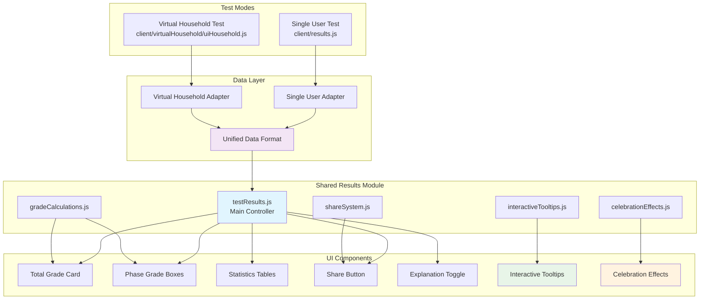
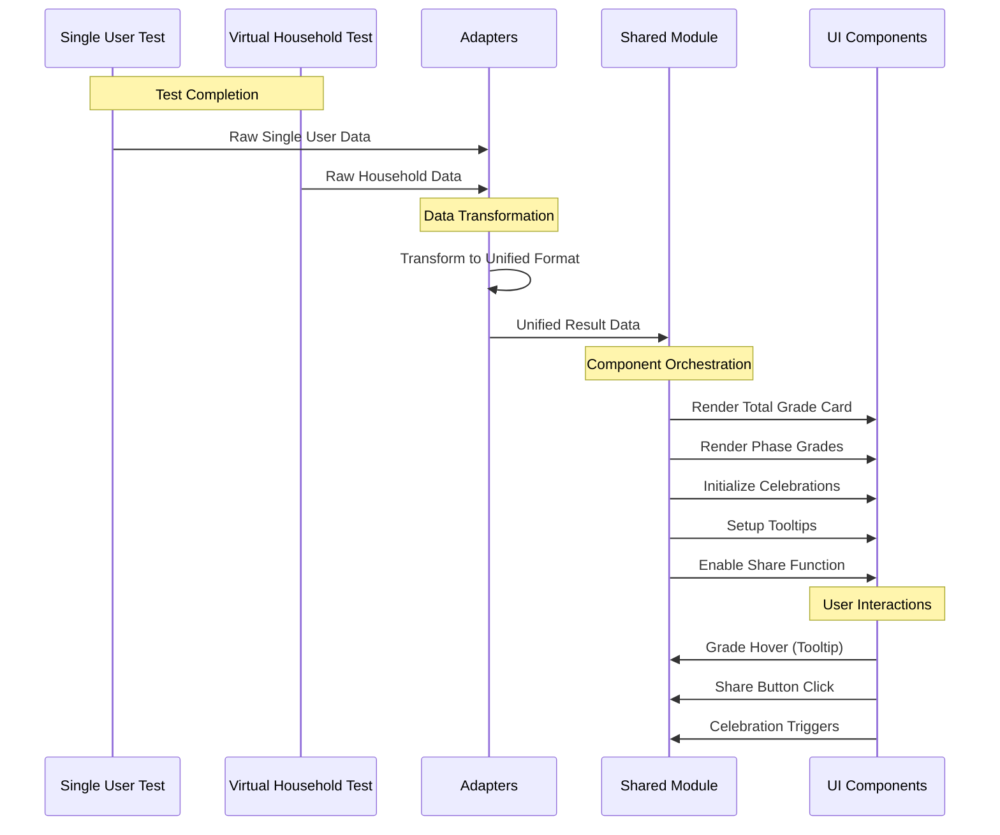
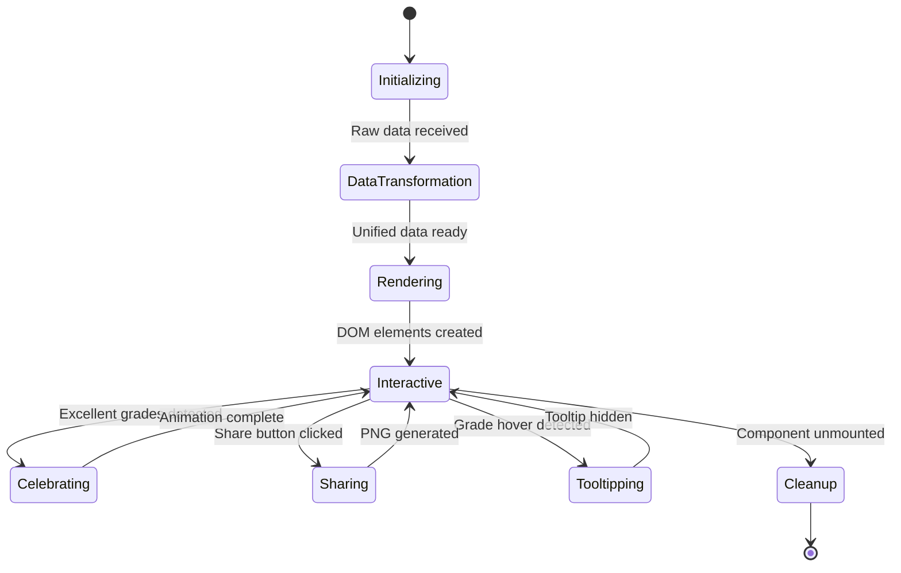

# Shared Results Module Architecture

## System Architecture Overview



## Data Flow Architecture



## Module Interaction Matrix

| Module | testResults.js | celebrationEffects.js | interactiveTooltips.js | shareSystem.js | resultAdapters.js |
|--------|---------------|----------------------|----------------------|----------------|------------------|
| **testResults.js** | - | ✓ Orchestrates | ✓ Orchestrates | ✓ Orchestrates | ✓ Consumes |
| **celebrationEffects.js** | ✓ Called by | - | ✗ Independent | ✗ Independent | ✗ Independent |
| **interactiveTooltips.js** | ✓ Called by | ✗ Independent | - | ✗ Independent | ✗ Independent |
| **shareSystem.js** | ✓ Called by | ✗ Independent | ✗ Independent | - | ✗ Independent |
| **resultAdapters.js** | ✓ Feeds into | ✗ Independent | ✗ Independent | ✗ Independent | - |

## Component Responsibility Matrix

### Core Responsibilities

| Component | Primary Function | Secondary Functions | Dependencies |
|-----------|-----------------|-------------------|--------------|
| **testResults.js** | Main orchestrator, DOM manipulation | Event coordination, cleanup | All other modules |
| **resultAdapters.js** | Data transformation | Format validation | gradeCalculations.js |
| **celebrationEffects.js** | Animations, visual effects | Confetti, sparkles, bounce | DOM APIs |
| **interactiveTooltips.js** | Hover interactions | Positioning, content display | DOM APIs |
| **shareSystem.js** | PNG generation, downloads | html2canvas integration | html2canvas library |
| **gradeCalculations.js** | Grade logic, thresholds | CSS class mapping | None |

## State Management



## Error Handling Strategy

### 1. Data Transformation Errors
```javascript
// In resultAdapters.js
try {
  const unifiedData = adapter.transform(rawData);
  return unifiedData;
} catch (error) {
  console.error('Data transformation failed:', error);
  return createFallbackData(rawData);
}
```

### 2. Rendering Errors
```javascript
// In testResults.js
try {
  displayUnifiedResults(data, containerId);
} catch (error) {
  console.error('Results rendering failed:', error);
  displayErrorMessage(containerId, 'Unable to display results');
}
```

### 3. Feature Degradation
- **Celebrations fail**: Continue without animations
- **Tooltips fail**: Continue without hover effects
- **Share fails**: Continue without share functionality
- **Statistics fail**: Show grades only

## Performance Considerations

### 1. Lazy Loading
```javascript
// Load celebration effects only when needed
async function triggerCelebration(grade) {
  if (['A+', 'A'].includes(grade)) {
    const { createConfettiEffect } = await import('./celebrationEffects.js');
    createConfettiEffect(container);
  }
}
```

### 2. Event Listener Management
```javascript
// Centralized cleanup to prevent memory leaks
export function cleanupResults(containerId) {
  cleanupCelebrationEffects(containerId);
  cleanupTooltips(containerId);
  cleanupShareSystem(containerId);
}
```

### 3. DOM Optimization
- Batch DOM updates
- Use document fragments for complex rendering
- Minimize reflows and repaints

## Testing Strategy

### 1. Unit Tests
- **Data Adapters**: Test transformation accuracy
- **Grade Calculations**: Verify grade logic
- **Tooltip System**: Test positioning and content
- **Share System**: Mock html2canvas, test PNG generation

### 2. Integration Tests
- **Single User Integration**: End-to-end test with real data
- **Virtual Household Integration**: End-to-end test with household data
- **Cross-browser Compatibility**: Test celebration effects and tooltips

### 3. Visual Regression Tests
- **Grade Card Rendering**: Screenshot comparison
- **Celebration Effects**: Animation verification
- **Share PNG Output**: Image comparison

## Security Considerations

### 1. Data Sanitization
```javascript
// Sanitize user-generated content in tooltips
function sanitizeTooltipContent(content) {
  return content.replace(/<script\b[^<]*(?:(?!<\/script>)<[^<]*)*<\/script>/gi, '');
}
```

### 2. PNG Generation Safety
```javascript
// Validate container content before PNG generation
function validateShareableContent(container) {
  // Remove any potentially harmful elements
  const scripts = container.querySelectorAll('script');
  scripts.forEach(script => script.remove());
}
```

## Accessibility Features

### 1. ARIA Labels
```javascript
// Add accessibility attributes to grade elements
function addAccessibilityAttributes(gradeElement, grade, description) {
  gradeElement.setAttribute('role', 'img');
  gradeElement.setAttribute('aria-label', `Grade ${grade}: ${description}`);
}
```

### 2. Keyboard Navigation
```javascript
// Make tooltips keyboard accessible
function addKeyboardSupport(gradeElement, tooltip) {
  gradeElement.setAttribute('tabindex', '0');
  gradeElement.addEventListener('focus', showTooltip);
  gradeElement.addEventListener('blur', hideTooltip);
}
```

### 3. Screen Reader Support
- Descriptive alt text for approved badges
- Meaningful aria-labels for interactive elements
- Proper heading hierarchy

## Browser Compatibility

### Supported Browsers
- **Chrome**: 80+ (full feature support)
- **Firefox**: 75+ (full feature support)
- **Safari**: 13+ (full feature support)
- **Edge**: 80+ (full feature support)

### Feature Degradation
- **Older browsers**: Disable celebrations, maintain core functionality
- **Mobile browsers**: Optimize touch interactions for tooltips
- **Low-end devices**: Reduce animation complexity

## Deployment Considerations

### 1. Bundle Size Optimization
- Tree-shake unused celebration effects
- Lazy load share functionality
- Minimize CSS duplication

### 2. CDN Strategy
- Host celebration assets (confetti images) on CDN
- Cache-bust shared module files appropriately
- Optimize PNG generation library loading

### 3. Rollback Plan
- Feature flags for shared module activation
- Fallback to legacy results display
- Gradual migration strategy

This architecture document provides a comprehensive technical foundation for implementing the shared results module system while ensuring maintainability, performance, and reliability.